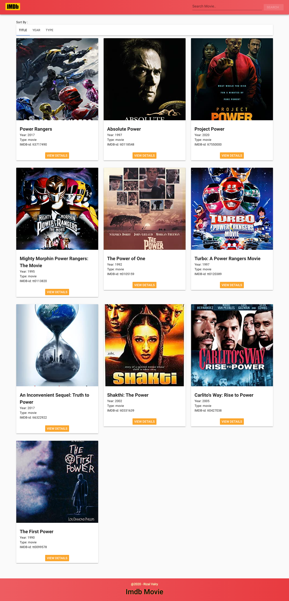

# movie-app by rizal-valry @2020 (Copying is strictly prohibited)

## Project setup
npm install

### Compiles and minifies for production
npm run build

### Compiles and hot-reloads for development
npm run serve

### Run your tests
npm run test

### Lints and fixes files
npm run lint

## Library component 
<ol start="1">
<li>Bootstrap</li>
<li>Axios Vue</li>
<li>Sass/Scss</li>
<li>Vuetify Framework</li>
</ol>

